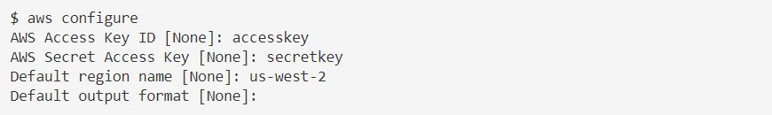
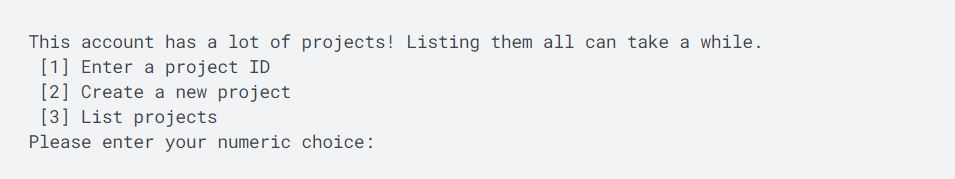
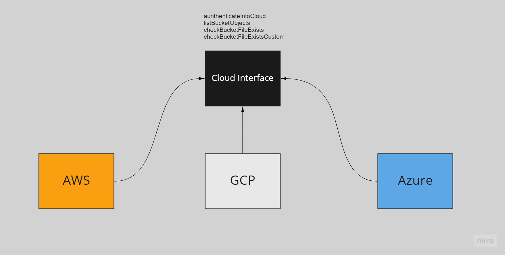

# Aws_Azure_GCP_Functions

Using Java SDKs for AWS, Azure and GCP to get authenticate, list bucket content and perform other different operations. This was done to allow the user
to have data in cloud storages.


### Table of Contents

- [Overview](#overview)
- [AWS](#AWS)
- [Azure](#Azure)
- [GCP](#GCP)
- [Program Flow](#program-flow)
- [Documentation and Material](#documentation-and-material)
- [Tools and Technologies](#tools-and-technologies)

---


### Overview

- Java Cloud Interface was implemented by Aws, Azure and GCP code so that have a common api calling. 
- All 3 have same function name that interface makes us to implement but their own way of executing.
- This was code is being used in many different patterns Reg, Load, Bulk Reg, Bulk Load, Export, NOS Read, NOS Write.


---

### AWS

- Will need to install the AWS CLI and configure our credentials.
- As this all was coded in java and spring boot was used will also need to add in maven dependencies.
- Check the maven site for aws cli ones.

```bash
  aws configure
```
- The above will prompt us to enter our AccessId, AccessKey, Region, Output Format.
- After this has been configured we will have an .aws folder and will have 2 files
  - credentials
  - config
  
- Our code will use these files to authenticate itself so that it can perform the different functions.

<p align="center">
  
</p>

---

#### Azure

- Azure will need to install some utilities
  - az copy
  - az 

- Pretty easy to download these and step up.
- If you are going to use a terminal to list content of bucket you will need to provide credentials for both az copy and az.
- Login to your azure portal and create a service principal, grant blob storage access to your user.
- Once you are done will that you will need to copy ClientID/AppID, Tenant/TenantId, Secret/ClientSecret.
- Create a **credentials** file on your root user path, this path will be provided to our code.

```bash
  ClientId=
  Tenantd=
  ClientSecret=
  StorageAccountName=
```

```bash
set AZCOPY_SPA_CLIENT_SECRET=<ClientSecret>

azcopy login --service-principal  --application-id <ClientID> --tenant-id=<TenantID>
```

- Similarly if you are going to use az.

```bash
az login --service-principal -u <ClientId> --tenant <TenantId> -p <ClientSecret>
```

-- To check if az copy and az working try these commands.

```bash
  azcopy list https://<StorageAccount>.blob.core.windows.net/<bucket>/
```

```bash
  az storage fs file list -f <bucket> --account-name <StorageAccount> --auth-mode login
```

- After setting this all we will be able to execute the functions in azure.

---

### GCP

- GCP will require us to install the sdk.
- It can be downloaded for windows and linux. After downloading and unzipping will configure it.

```bash
  ./google-cloud-sdk/install.sh
```

```bash
  ./google-cloud-sdk/bin/gcloud init
```

- The steps are in the documentation follow those. It will ask for account and other details.


<p align="center">
  
</p>
---

### Program Flow

- All the 3 cloud pattern implement the cloud interface. This allow us to have same function name but different implemention.
- The 3 cloud patterns are used in a number of different processes based on user cloud vendor they can use which one to use.
- 1 for AWS, 2 for GCP and 3 for Azure.

<p align="center">
  
</p>


---

 

### Documentation and Material

- [Azure Service Principal](https://learn.microsoft.com/en-us/azure/active-directory/develop/howto-create-service-principal-portal)
- [AWS Configure](https://docs.aws.amazon.com/cli/latest/reference/configure/)
- [GCP Configure](https://cloud.google.com/sdk/docs/initializing)
- [Snowflake Youtube Playlist](https://www.youtube.com/playlist?list=PLy4OcwImJzBIX77cmNYiXIJ3tBhpNSUKI)
- Thanks to Kahan Data Solutions for the demo videos.
  
---
### Tools and Technologies

- Java Spring Boot
- AWS, Azure, GCP SDK, CLI
- Maven

